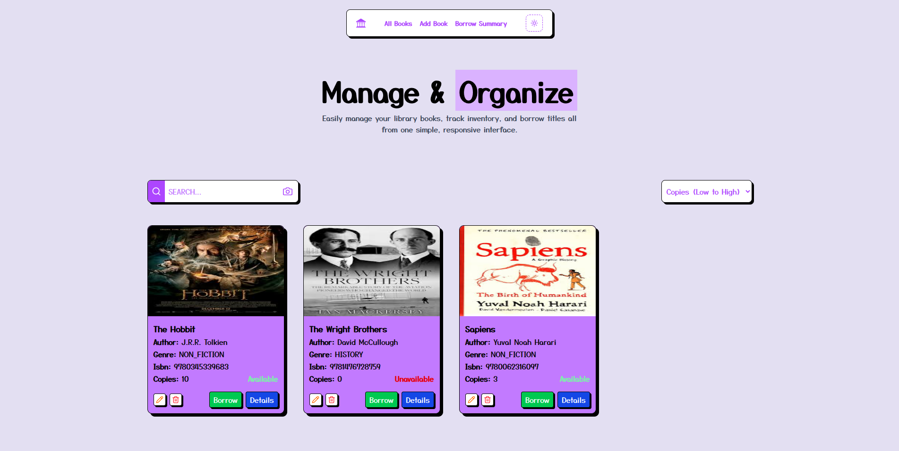

<h1 align="center">📚 Libra – Minimal Library Management System</h1>

<p align="center">Libra is a clean, responsive, and fully functional Library Management System built with React, TypeScript, and Redux Toolkit Query. This project enables users to perform core library operations such as viewing, creating, editing, deleting, and borrowing books all without authentication or complex integrations.
</p>



---

**`Frontend`:** [Link](https://minimal-library-management-client.vercel.app)  
**`API Documentation`:** [https://github.com/afsar-dev/Library-management-server/blob/main/README.md](https://github.com/afsar-dev/Library-management-server/blob/main/README.md)  

## 🚀 Features

- Public access — no authentication required
- View, add, edit, and delete books
- Borrow books with quantity and due date
- Auto-update availability based on copies
- View aggregated borrow summary (book title, ISBN, total quantity)

## 📦 Technologies Used

- **React** – UI library for building interactive interfaces
- **TypeScript** – Type-safe JavaScript for better development experience
- **Redux Toolkit + RTK Query** – State and API data management
- **React Router** – Client-side routing for navigation
- **Tailwind CSS** – Utility-first CSS framework for styling
- **Vite** – Fast bundler and development server

## 🛠️ Project Setup

```bash
# 1. Clone the repository
git clone https://github.com/afsar-dev/Library-management-client
cd Library-management-client

# 2. Install dependencies
bun install

# 3. Set up environment variables
touch .env
```

### `.env` Example:

```
VITE_CLOUDINARY_CLOUD_NAME=******
```

## 📂 Folder Structure

```sh
LIBRARY-MANAGEMENT-CLIENT/
├── .vercel/                    # Vercel deployment configuration
├── dist/                       # Production build output
├── node_modules/               # Project dependencies
├── public/                     # Static public assets
├── src/                        # Source code
│   ├── assets/                 # Images, logos, and static files
│   ├── components/             # Reusable UI components
│   ├── hooks/                  # Custom React hooks
│   ├── lib/                    # Utility functions and helpers
│   ├── pages/                  # Page-level components for routes
│   ├── provider/               # Context and provider components (e.g., Redux Provider)
│   ├── redux/                  # Redux Toolkit slices and RTK Query setup
│   ├── routes/                 # Route configurations using React Router
│   ├── types/                  # Global TypeScript types and interfaces
│   ├── App.tsx                 # Root app component
│   ├── index.css               # Global CSS with Tailwind imports
│   ├── main.tsx                # App entry point
│   └── vite-env.d.ts           # Vite environment type declarations
├── .env                        # Environment variables
├── .gitignore                  # Git ignore rules
├── bun.lock                    # bun lockfile
├── components.json             # (Optional) Component mapping/config
├── eslint.config.js            # ESLint configuration
├── index.html                  # Root HTML template
├── org.png                     # Logo or illustration image
├── package.json                # Project metadata and scripts
├── README.md                   # Project documentation
├── tsconfig.app.json           # TypeScript config (for app scope)
├── tsconfig.json               # Base TypeScript configuration
├── tsconfig.node.json          # TypeScript config (for Node usage)
├── vercel.json                 # Vercel project settings
└── vite.config.ts              # Vite bundler configuration
```

## Pages Overview

- **Home Page (`/`)**  
  Displays all books.

- **All Books Page (`/all-books`)**  
  Shows a list of all books with available actions such as edit, delete, borrow, and view.

- **Book Details Page (`/all-books/:id`)**  
  Displays detailed information about a selected book.

- **Add Book Page (`/add-book`)**  
  Contains the form to create a new book entry.

- **Borrow Summary Page (`/borrow-summary`)**  
  Shows a summary of all borrowed books.

## Author

**Md Afsar Mahmud**  
Full Stack Developer  
[HackerRank](https://www.hackerrank.com/profile/mdafsar) •
[LinkedIn](https://www.linkedin.com/in/md-afsar-mahmud)
